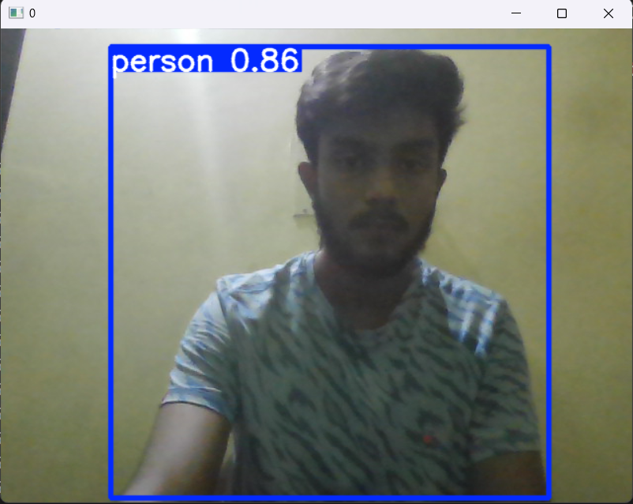
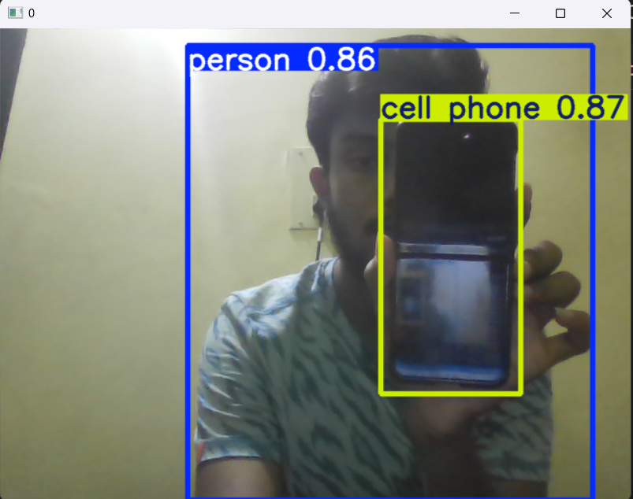

# Real-Time Object Detection with YOLOv5  

  
*Figure 1: Detecting a person*  

  
*Figure 2: Detecting mobile phone and person*  

## � Overview  
This project implements real-time object detection using **YOLOv5** in Python. It captures live video from your webcam, detects objects, and draws bounding boxes with labels and confidence scores.  

## ✨ Features  
- Real-time object detection using YOLOv5  
- Supports webcam or video file input  
- Displays detection confidence scores  
- Customizable detection threshold  
- Lightweight and easy to deploy  

## ⚙️ Setup & Installation  

1. **Clone the repository**  
   ```bash
   git clone https://github.com/ch-ankit679/Realtime-Object-Detection.git
   cd Realtime-Object-Detection
   ```

2. **Install dependencies**  
   ```bash
   pip install -r requirements.txt
   ```

3. **Download YOLOv5 weights**  
   ```bash
   wget https://github.com/ultralytics/yolov5/releases/download/v6.0/yolov5s.pt -P models/
   ```

## � Usage  

### Run with default webcam  
```bash
python detect.py --source 0  # 0 for default webcam
```

### Run with a video file  
```bash
python detect.py --source video.mp4
```

### Optional Arguments  
- `--conf-thres` : Confidence threshold (default: 0.5)  
- `--view-img` : Display detection in a window (default: True)  
- `--save-txt` : Save detection results to a text file  

Example:  
```bash
python detect.py --source 0 --conf-thres 0.7 --view-img
```

## 📌 Notes  
- Requires a **CUDA-enabled GPU** for best performance (works on CPU but slower).  
- Tested on **Python 3.8+**.  

## 🤝 Contributing  
Feel free to open issues or submit pull requests for improvements!  

## 📜 License  
MIT  

---

Let me know if you'd like any modifications or additional details! 🚀
